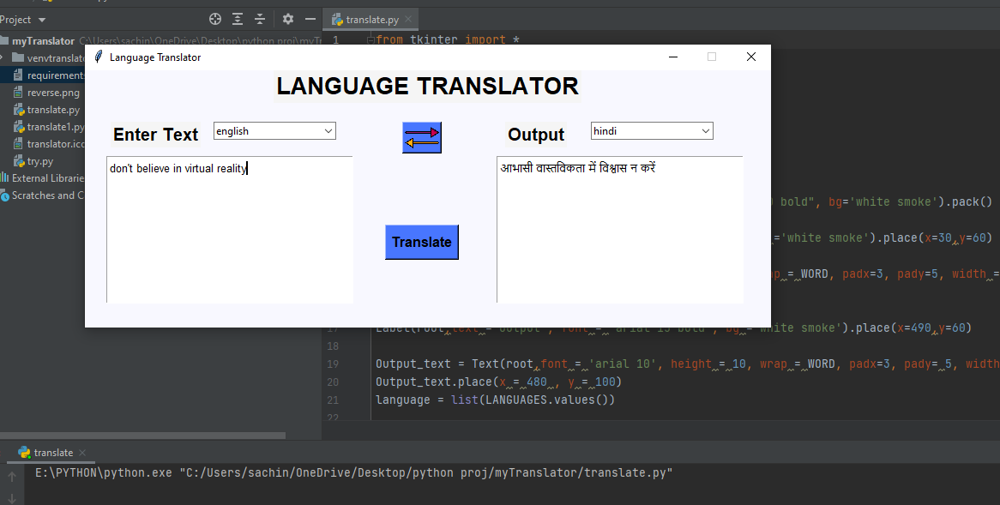

# MyTranslator
Language converter created using **Tkinter** and **Googletrans** packages, which converts souce language into target language.
<p>
User can change its source and target lang.
</p>
<p>

</p>

---
## Want to use :
```shell
    git clone https://github.com/sakshamsin09/MyTranslator.git
    pip install -r requirements.txt
    python translate.py
```
